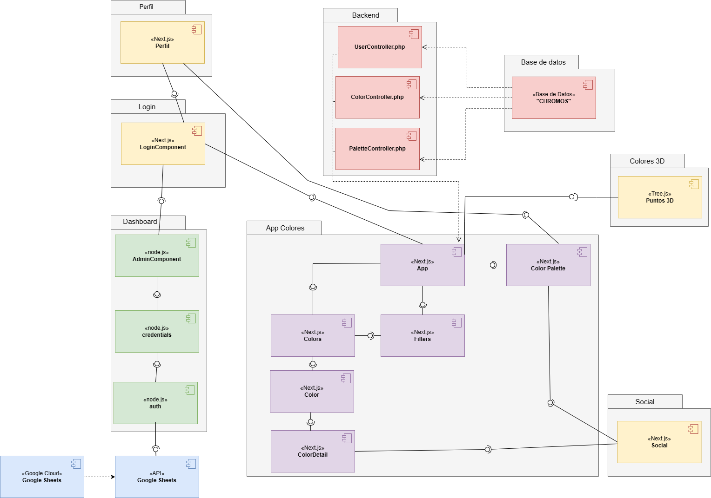

# CARTA CROMATICA COLOR RIOS

## Proyect Description

This is a [Next.js](https://nextjs.org/) project bootstrapped with [`create-next-app`](https://github.com/vercel/next.js/tree/canary/packages/create-next-app).

Its main purpose is to be used as a web component that acts as a gallery to visualize colors from a database. Users can select colors, save or export them for use in other projects, and share them online with other users.

## Design



This web component works in two parts:

### 1) Backend:

Manages a Google Sheets page, transforms it into an SQL database. This information is fetched and utilized by the frontend.

### 2) Frontend:
Manages the user interactions and many different pages:
- **Main page:** features components such as a color gallery, filters to update the displayed colors, color information upon clicking, and a bar that stores selected colors.
- **Login and registration.**
- **3D page:** displays all the colors in the gallery as points in a 3D environment.
- **Profile and Social:** For users to view their own favorite colors and palettes, and the ones shared within the community.
- **Dashboard:** Accessible only to administrators. Allows them to view important information about colors, users and trends.

## Requirements

- Install [Node.js](https://nodejs.org/en)
- Install [Node Package Manager (NPM)](https://docs.npmjs.com/downloading-and-installing-node-js-and-npm) (Recommended), or [Yarn](), or [Performant NPM](https://pnpm.io/installation).
- Install [Next.js](https://nextjs.org/docs/getting-started/installation).

## Code

## Deployment

First, run the development server:

```bash
npm run dev
# or
yarn dev
# or
pnpm dev
```

Open [http://localhost:3000](http://localhost:3000) with your browser to see the result.

You can start editing the page by modifying `pages/index.js`. The page auto-updates as you edit the file.

[API routes](https://nextjs.org/docs/api-routes/introduction) can be accessed on [http://localhost:3000/api/hello](http://localhost:3000/api/hello). This endpoint can be edited in `pages/api/hello.js`.

The `pages/api` directory is mapped to `/api/*`. Files in this directory are treated as [API routes](https://nextjs.org/docs/api-routes/introduction) instead of React pages.

This project uses [`next/font`](https://nextjs.org/docs/basic-features/font-optimization) to automatically optimize and load Inter, a custom Google Font.

### Learn More

To learn more about Next.js, take a look at the following resources:

- [Next.js Documentation](https://nextjs.org/docs) - learn about Next.js features and API.
- [Learn Next.js](https://nextjs.org/learn) - an interactive Next.js tutorial.

You can check out [the Next.js GitHub repository](https://github.com/vercel/next.js/) - your feedback and contributions are welcome!

### Deploy on Vercel

The easiest way to deploy your Next.js app is to use the [Vercel Platform](https://vercel.com/new?utm_medium=default-template&filter=next.js&utm_source=create-next-app&utm_campaign=create-next-app-readme) from the creators of Next.js.

Check out our [Next.js deployment documentation](https://nextjs.org/docs/deployment) for more details.